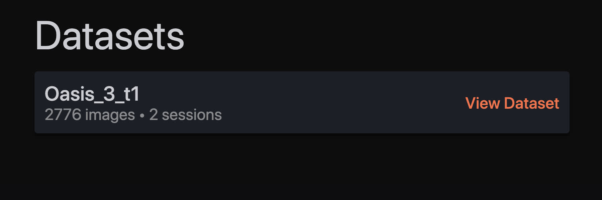
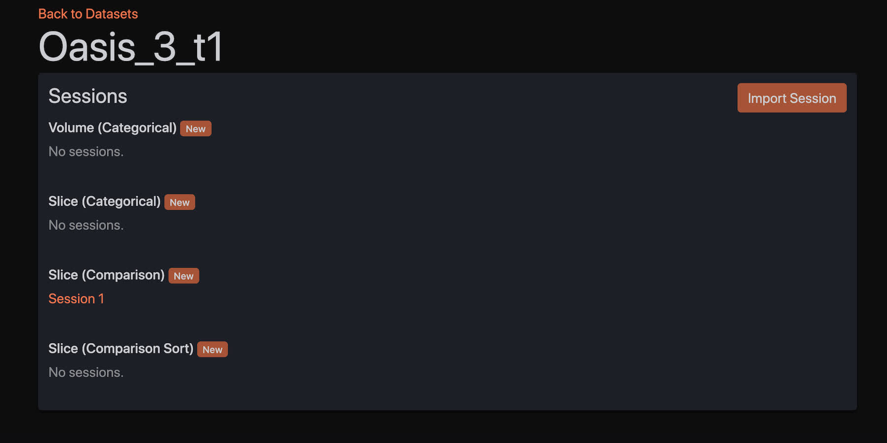
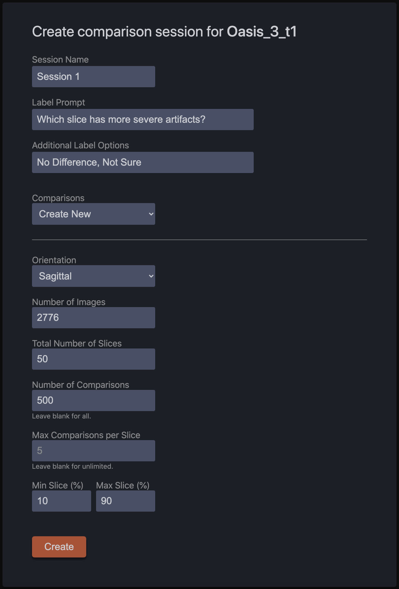
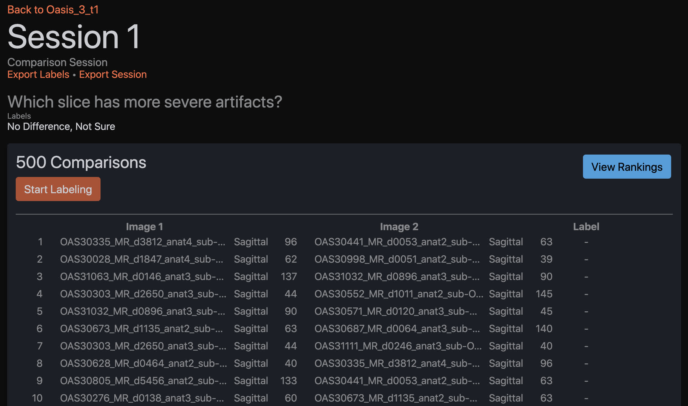
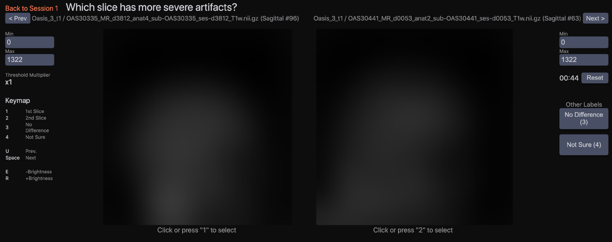

# SliceLabeler
### Browser-based GUI for labeling MRI volumes and slices.

## Quickstart

### Python Version:
The latest version of Python 3 is recommended.

Python 3.6 or newer is required.
### Installation:
First, clone the repo and cd into the new directory.

Then, create a python virtual environment and install the dependencies using the following commands:

#### Mac/Linux:
```shell script
python3 -m venv venv
source venv/bin/activate
pip install -r requirements.txt
```

#### Windows CMD:
```
python3 -m venv venv
venv\Scripts\activate.bat
pip install -r requirements.txt
```

### Data:

SliceLabeler expects MRI volumes in the following directory structure:

```
SliceLabeler/
  data/
    datasets/
      my_dataset_1/
        image_1.nii.gz
        image_2.nii.gz
        ...
      my_dataset_2/
        image_1.nii.gz
        image_2.nii.gz
        ...
```

### Run:

SliceLabeler is a Python Flask app. To run it, activate the virtualenv and start the Flask server using the following commands.

Then, navigate to ```http://127.0.0.1:5000/``` in a browser window to use the application.

#### Mac/Linux:
```shell script
source venv/bin/activate
export FLASK_APP=application.py
flask run
```
#### Windows CMD:
```
venv\Scripts\activate.bat
set FLASK_APP=application.py
flask run
```

To deactivate the virtual environment when you're done, you can use the ```deactivate``` command:

#### Mac/Linux/Windows:
```shell script
deactivate
```

## User Guide:

### Datasets



This page shows all of your datasets from the ```data/datasets``` directory.

### Dataset Overview



This page displays an overview of a dataset and its labeling sessions. Labeling sessions allow you to designate a subset of your dataset for labeling and share it with collaborators.

On this page you can **create a new session**, or **select an existing session** to view more details. You can also **import a session** sent to you by a collaborator and label the exact same set of data.

When importing a session, ensure you have the same data as your collaborator placed in your ```data/datasets``` directory.

There are four types of labeling session:

- **Volume (Categorical):** Allows you to classify all of the volumes in your dataset.
- **Slice (Categorical):** Allows you to classify a set of slices from your dataset.
- **Slice (Comparison):** Allows you to label a set of slices from your dataset with pairwise comparisons.
- **Slice (Sort):** Allows you to label a set of slices from your dataset using pairwise comparisons which are sampled actively using a sorting algorithm.

### Create Session



This page shows the options for the creation of a new labeling session. Each session type has a different set of options. Follow the on-screen instructions to create a session.

### Session Overview



This page shows all of the details for a labeling session, including its metadata and all of your existing labels.

From here you can:

- **Start labeling your data** by clicking the "Start Labeling" button.
- **Export your current labels** by clicking the "Export Labels" button.
- **Export the session and its metadata** by clicking the "Export Session" button. This allows you to share this session with collaborators so you can label the same data.
- **Edit a specific label** by hovering over a row and clicking the "Edit Label" button.
- **View the rankings for your slices** (for comparison sessions) by clicking the "View Rankings" button.

### Labeling Interface



This is where you label your data. The interface for each session type is slightly different, but all of them include similar functionality.

- **Choose a label** by clicking one of the label buttons on the right, or by clicking on one of the two slices in the case of pairwise comparisons.
- **Adjust the brightness/tone-mapping** by changing the "Min" and "Max" values.
- **Reset the timer** with the reset button. The timer records the amount of time taken for each label. This data is included when labels are exported, and can be used for quality control experiments.
- **Jump to the next/previous label** using the "Prev" and "Next" buttons at the top left and right of the page.

There are also keyboard shortcuts for all of these actions, as shown in the keymap on the left side of the page.

### See also:
- [Venv documentation](https://docs.python.org/3/library/venv.html)
- [Flask documentation](https://flask.palletsprojects.com/en/1.1.x/quickstart/)
